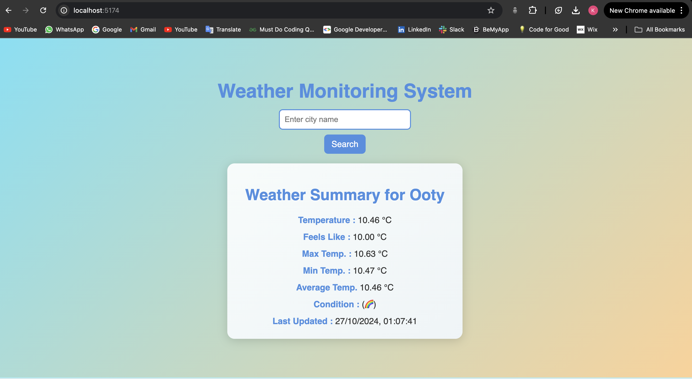

# Weather Monitoring System

Welcome to the **Weather Monitoring System**, a real-time weather application that fetches, stores, and displays weather data for various cities. This application allows users to search for a city and view its current weather conditions, including temperature, humidity, and other essential weather parameters. The application uses modern web technologies to provide an interactive and responsive user interface.

## 🛠️ Features

- **Real-Time Weather Data:** Fetches current weather conditions using the OpenWeatherMap API.
- **City Search Functionality:** Users can search for any city and retrieve its weather data instantly.
- **Data Storage:** Weather data is stored in Firebase, ensuring that information is readily accessible.
- **Dynamic Updates:** The UI updates dynamically to show weather conditions without needing to refresh the page.
- **Responsive Design:** The application is designed to be visually appealing on various devices, with a clean and modern UI.

## Technologies Used

**Weather Monitoring System** utilizes a variety of technologies for both the frontend and backend. Here’s a breakdown:

### Frontend

- **[React](https://reactjs.org/)**: A JavaScript library for building user interfaces.
- **[styled-components](https://styled-components.com/)**: A library for writing CSS-in-JS, enabling the creation of styled React components.
- **[Axios](https://axios-http.com/)**: A promise-based HTTP client for making requests to the API.

### Backend

- **[Node.js](https://nodejs.org/)**: JavaScript runtime for executing server-side code.
- **[Express](https://expressjs.com/)**: A web application framework for Node.js to build APIs.
- **[OpenWeatherMap API](https://openweathermap.org/api)**: A service for fetching weather data.
- **[Firebase](https://firebase.google.com/)**: A platform for developing mobile and web applications, providing a real-time NoSQL database for storing weather data.

## 🔧 Firebase Configuration

To set up Firebase for this application, follow these steps:

1. **Create a Firebase Project:**
   - Go to the [Firebase Console](https://console.firebase.google.com/).
   - Click on "Add Project" and follow the prompts to create a new project.

2. **Set Up Firestore:**
   - In your Firebase project, navigate to the Firestore Database section.
   - Click on "Create Database" and follow the setup instructions to create a Firestore database.

3. **Get Firebase Configuration:**
   - In your project settings, find the "Firebase SDK snippet" section and select "Config."
   - Copy the configuration details, which look something like this:
     ```javascript
     const firebaseConfig = {
       apiKey: "your_api_key",
       authDomain: "your_project_id.firebaseapp.com",
       projectId: "your_project_id",
       storageBucket: "your_project_id.appspot.com",
       messagingSenderId: "your_messaging_sender_id",
       appId: "your_app_id"
     };
     ```
   - This configuration is essential for connecting your application to Firebase.

## 🌍 OpenWeatherMap API Configuration

1. **Create an OpenWeatherMap Account:**
   - Sign up at [OpenWeatherMap](https://openweathermap.org/) and create an API key.

2. **API Key Usage:**
   - Use the obtained API key to authenticate requests to the OpenWeatherMap API for fetching weather data.
     ```plaintext
     OPENWEATHER_API_KEY=your_openweather_api_key
     ```

## 🔑 Environment Variables

For security reasons, sensitive information such as API keys and configuration settings should be stored in environment variables. In your project, create a `.env` file in the backend directory with the following contents:

```plaintext
OPENWEATHER_API_KEY=your_openweather_api_key
FIREBASE_CONFIG='your_firebase_config'
PORT=your_port(i have used 3001)
```

## 🖼️ Screenshots

Here are some screenshots of the Weather Monitoring System:




## 🚀 Getting Started

### Prerequisites

To run the Weather Monitoring System locally, you need to have the following installed:

- [Node.js](https://nodejs.org/)
- [npm](https://www.npmjs.com/) or [yarn](https://yarnpkg.com/)

### Installation

1. **Clone the repository:**
   ```bash
   git clone https://github.com/Kush-17/weather-monitoring.git
   cd weather-monitoring
   ```

2. **Install dependencies for the backend:**
   ```bash
   cd backend
   npm install
   ```

3. **Install dependencies for the frontend:**
   ```bash
   cd ../frontend
   npm install
   ```
   

### Running the Application

- **Start the Backend:**
  ```bash
  cd backend
  npm start
  ```

- **Start the Frontend:**
  ```bash
  cd ../frontend
  npm run dev
  ```

## 🌐 API Endpoints

Here are the available API endpoints for the Weather Monitoring System:

- **`GET /api/getWeather?city={city}`**: Fetch and store the current weather data for a specified city in Firebase.

- **`GET /api/dailySummary?city={city}`**: Retrieve stored weather data for a specified city from Firebase.

## 🧪 Testing

To run tests for both frontend and backend, you can use tools like Postman or directly interact with the endpoints using the provided UI.

### Backend Testing

You can test the backend endpoints using Postman:

1. **GET Weather Data:**
   - Endpoint: `/api/getWeather?city=Chennai`
   - This will store the weather data of Chennai in Firebase.

2. **Retrieve Weather Summary:**
   - Endpoint: `/api/dailySummary?city=Chennai`
   - This retrieves the stored weather data of Chennai for display.

### Frontend Testing

1. Open your browser and navigate to `http://localhost:5174`.
2. Enter a city name in the search bar and hit the search button.
3. Verify that the weather data appears on the screen without requiring a page refresh.

## 📜 Acknowledgments

- [OpenWeatherMap](https://openweathermap.org/api) for providing reliable weather data.
- [Firebase](https://firebase.google.com/) for efficient real-time database management.
- [React](https://reactjs.org/) for enabling a dynamic user interface.
- [Node.js](https://nodejs.org/) and [Express](https://expressjs.com/) for backend server management.

---

Thank you for checking out the Weather Monitoring System! If you have any questions or feedback, feel free to reach out.
